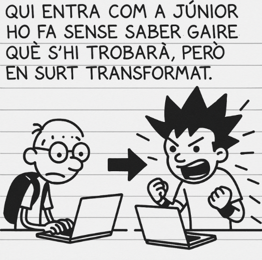

# **EverPia 4 – “L’última prova: de júnior a professional”**  
### *El final de la saga, l’inici d’un camí real*

## 🏢 **Descripció del projecte**
Després de setmanes convivint amb el ritme intens, caòtic i imprevisible d’una consultora tecnològica, arriba l’últim capítol de la trilogia EverPia. És un moment especial: barreja entusiasme, maduresa i la sensació real que un cicle s’acaba… i un altre està a punt de començar.

A les consultores, el camí professional es repeteix una vegada i una altra:  
> *Qui entra com a júnior no sap què s’hi trobarà, però quan surt, ja no és el mateix.*

Has apagat incendis, resolt problemes misteriosos, ajudat companys amb anys d’experiència, assumit tasques que ni sortien al contracte i après a una velocitat que no surt als manuals. Aquesta intensitat et transforma.

Un dia t’adones que tens criteri, eines, documentació pròpia i una mirada diferent:  
la mirada d’un professional.

Això és exactament EverPia 4: el moment de demostrar que estàs preparat per **fer el salt**.  
La darrera oportunitat per brillar **abans de sortir per la porta gran**.

No és un conjunt de tasques.  
És la **teva carta de presentació professional**.

---

## 🎯 **Missió del projecte**
Aquest projecte és l’etapa final de les pràctiques internes a EverPia. És l’ocasió per demostrar:

- Què has après realment  
- Com treballes i com documentes  
- Com investigues i proposes solucions  
- Com afrontes reptes complexos amb rigor  
- Com col·labores amb un equip i prens decisions madures  

Durant quatre setmanes hauràs de donar resposta a encàrrecs reals dins de l’ecosistema EverPia, assumint rols i responsabilitats molt similars als d’una empresa tecnològica real de mida petita o mitjana.

---

## 💡 **Objectius generals**
Aquest projecte sintetitza i integra tots els mòduls treballats durant el curs. L’alumne haurà de:

1. **Integrar coneixements tècnics en un context professional realista**, combinant:  
   - Seguretat informàtica  
   - Sistemes Operatius en Xarxa  
   - Serveis de Xarxa  
   - Aplicacions Web  
2. Treballar de forma coordinada i aplicada, tal com es faria en una consultora real.  
3. Demostrar autonomia progressiva i capacitat de decisió.  
4. Documentar processos amb qualitat professional.  
5. Presentar resultats clars, útils i ben justificats.

---

## 🧩 **Tasques a desenvolupar**
Durant el desenvolupament del projecte, hauràs d’afrontar encàrrecs en àrees com:

- Gestió d’emergències i incidències reals  
- Millora de processos interns  
- Automatització de sistemes i scripts  
- Administració i supervisió de repositoris  
- Implementació de serveis d’accés remot  
- Desplegament de solucions web i de comerç electrònic  
- Suport tècnic coordinat amb l’equip EverPia  

## Tasques a desenvolupar
   - [Tasca01](Tasca-01)
   - [Tasca02](Tasca-02)
   - [Tasca03](Tasca-03)
   - [Tasca04](Tasca-04)
   - [Tasca05](Tasca-05)
   - [Tasca06](Tasca-06)
   - [Tasca07](Tasca-07)
   - [Tasca08](Tasca-08)
   - [Tasca09](Tasca-09)
   - [Tasca10](Tasca-10)
   - [Tasca11](Tasca-11)
   - [Tasca12](Tasca-12)
   - [Tasca13](Tasca-13)
   - [Tasca14](Tasca-14)
   - [Tasca15](Tasca-15)
   - [Tasca16](Tasca-16)

